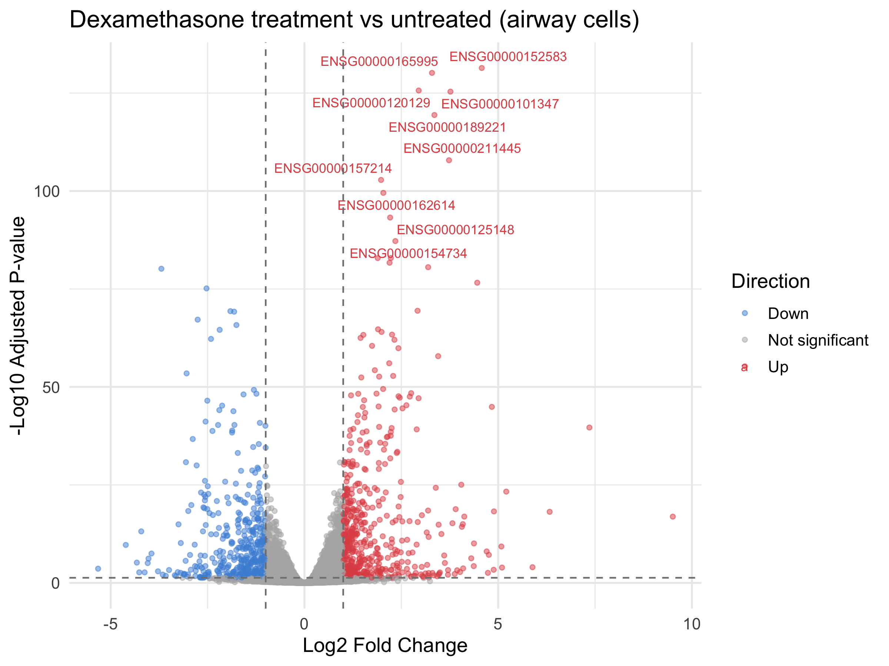
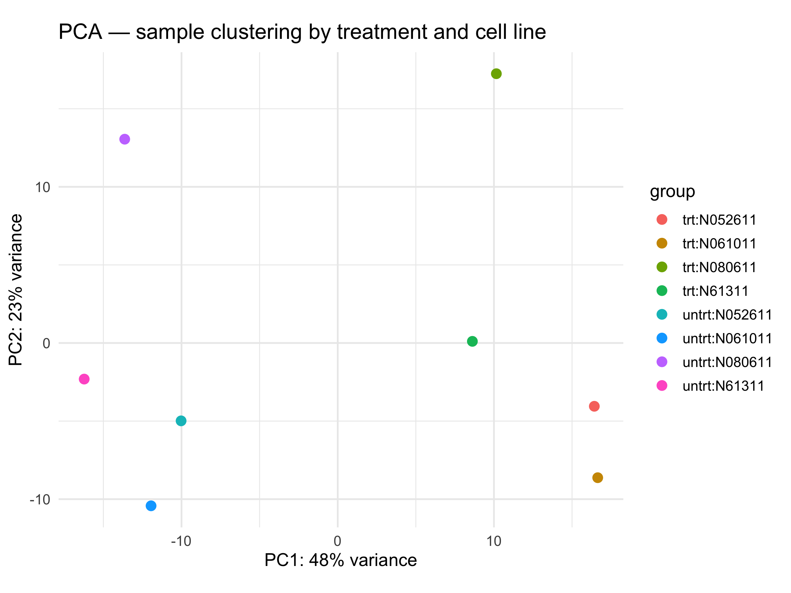
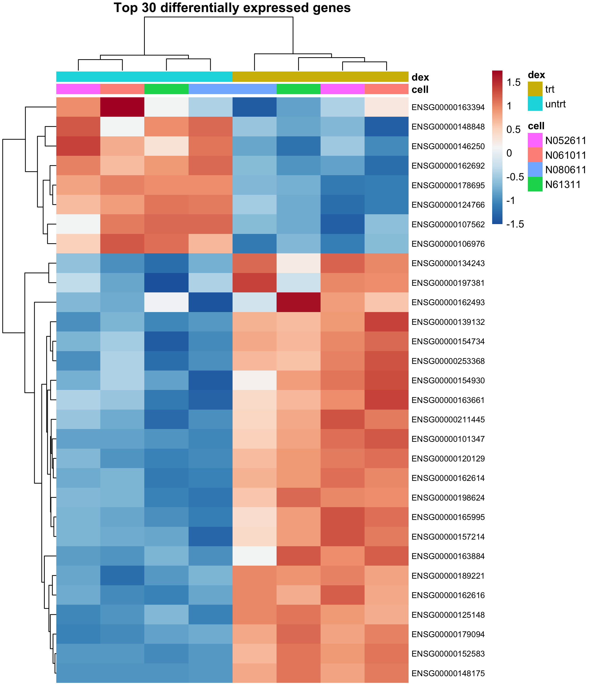

# RNA-seq Differential Expression Analysis with DESeq2

## Overview
This project analyses a publicly available RNA-seq dataset to identify genes 
differentially expressed in response to dexamethasone treatment in human airway 
smooth muscle cells. The analysis was performed in R using DESeq2, a standard 
tool used in pharmaceutical R&D and academic genomics research.

**Dataset:** Himes et al. (2014) — airway package (Bioconductor)  
**Samples:** 8 samples across 4 cell lines, treated vs untreated  
**Tools:** R, DESeq2, ggplot2, pheatmap

---

## Key Results
- **33,469 genes** tested for differential expression
- **2,604 genes significantly upregulated** (padj < 0.05, log2FC > 1)
- **2,216 genes significantly downregulated** (padj < 0.05, log2FC < -1)
- Treatment effect was the dominant source of variation (confirmed by PCA)

---

## Figures

### Volcano Plot
Shows all tested genes plotted by fold change (x-axis) and statistical 
significance (y-axis). Red = significantly upregulated, blue = significantly 
downregulated. Top 10 most significant genes are labelled.



### PCA Plot
Principal component analysis confirming clean separation between treated and 
untreated samples. PC1 captures the dexamethasone treatment effect.



### Heatmap
Expression patterns of the top 30 most significantly changed genes across all 
8 samples. Red = high expression, blue = low expression. Samples cluster 
cleanly by treatment group.



---

## How to reproduce this analysis
1. Install R and RStudio (cran.r-project.org)
2. Install required packages:
```r
BiocManager::install(c("DESeq2", "airway"))
install.packages(c("ggplot2", "ggrepel", "pheatmap", "RColorBrewer"))
```
3. Run `deseq2_airway_analysis.R`

---

## Background
This analysis was completed as part of a self-directed bioinformatics learning 
programme. My wet lab background includes NGS library preparation, plasmid 
cloning, and mammalian cell culture — this project extends that expertise into 
downstream data analysis.
